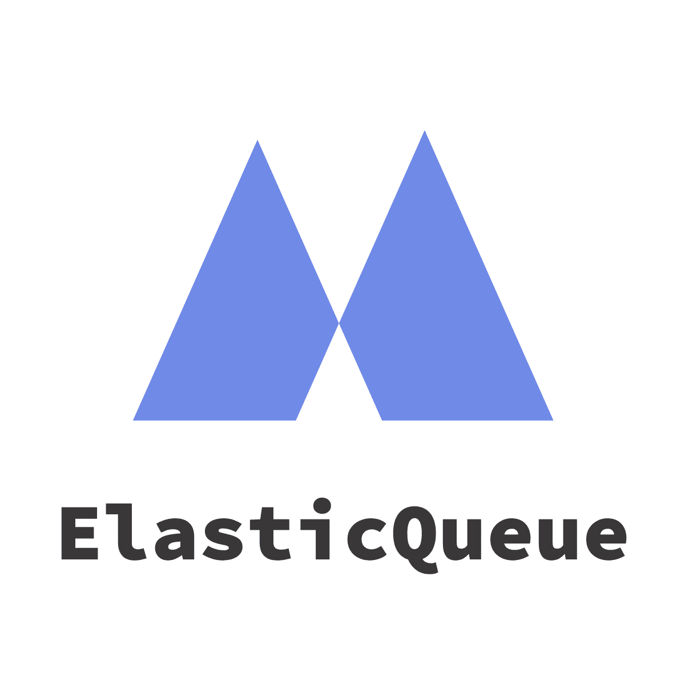

## Elastic Queue

*Running Your AI in a Kubernetes-Native Way.*

---

Elastic Queue is a Kubernetes-native AI Workload Queue, which can make AI run in Kubernetes quickly and smoothly. 

Elastic Queue supports queuing of jobs with different priorities, automatic start and stop, and fine-grained allocation and on-demand use of GPU resources through GPU sharing and hot swapping. Elastic Queue provides multi-tenancy and quota capabilities that allow administrators to allocate resources independently to different users. Elastic Queue also supports multiple clouds, allowing AI services to run on different clouds according to their needs. Elastic Queue supports the integration of mainstream AI computing frameworks, such as TensorFlow, Pytorch, MXNet KubeFlow, etc., and can seamlessly dock with customers' original AI computing platform.

- **Cloud Native Job Queue** submits and schedules AI tasks in Kubernetes-native mode, which is consistent with the original concept of Kubernetes, and reduces customer awareness and cost of use.
- **Intelligent Scheduling** schedules multi-priority job, supports automatic job start and stop, uses GPU sharing and swapping to improve customer GPU utilization.
- **Flexible Quota** makes multiple capacity policies to support quota allocation (max-min fairness / DRF, etc.) to maximize the efficiency of cluster resource allocation.
- **Multi-tenant Isolation** uses namespace to achieve multi-tenancy, independent quota and resource isolation between tenants, so that different customers can share Kubernetes clusters.
- **Multi-cloud Scaler** runs different queues to different public cloud providers, and optimizes the running cost of AI tasks using multi-cloud.
- **Multi-framework Integration** integrates the mainstream AI computing framework, simplifies the access process and reduces customer access costs